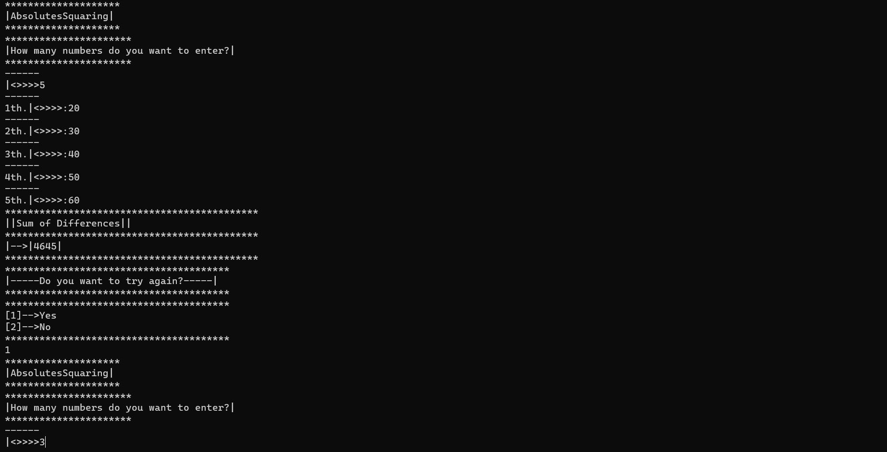

`Mutlak kare ve fark toplamı`

>Kullanıcıdan alınan n tane sayının 67'den küçük yada büyük olduğuna bakan. Küçük olanların farklarının toplamını, büyük ise de farkların mutlak karelerini alarak toplayıp ekrana yazdıran console uygulaması.
* `Örnek: Input: 56 45 68 77`
* ` Output: 33 101`
***
`Absolute square and sum of difference`

>Checks whether n numbers received from the user are less than or greater than 67. A console application that takes the sum of the differences of the smaller ones and the absolute squares of the differences and prints them on the screen.
* `Example: Input: 56 45 68 77`
* `Output: 33 101`
***
>Example Image
***

***