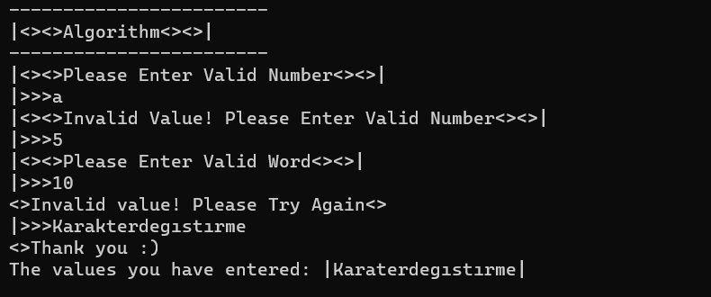

```Ekrandan bir string bir de sayı alan (aralarında virgül ile), ilgili string ifade içerisinden verilen indexteki karakteri çıkartıp ekrana yazdıran console uygulaması.```
>Örnek: Input: Algoritma,3 Algoritma,5 Algoritma,22 Algoritma,0
>Output: Algritma Algortma Algoritma lgoritma
---
---
```A console application that takes a string and a number from the screen (with commas between them), extracts the character in the given indext from the corresponding string expression and prints it to the screen.```
>Example: Input: Algorithm,3 Algorithm,5 Algorithm,22 Algorithm,0
>Output: Algritma Algorithm Algortma Algorithm Algorithm lgorithm
---
