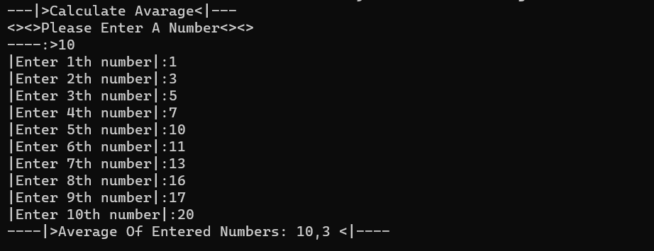

>* Ortalama Hesaplama
* Kulanıcıdan alınan derinliğe göre fibonacci serisindeki rakamların ortalamasını alıp ekrana yazdıran uygulama.
* Dikkat Edilmesi Gereken Noktalar :
* Kod tekrarından kaçınılmalı
* Single Responsibility kuralına uygun şekilde, uygulama sınıflara ve metotlara bölünmeli.
***
>* Average Calculation
* An application that averages the numbers in the fibonacci series according to the depth taken from the user and prints them on the screen.
* Points to be considered:
* Code repetition should be avoided
* The application should be divided into classes and methods, following the Single Responsibility rule.
***
