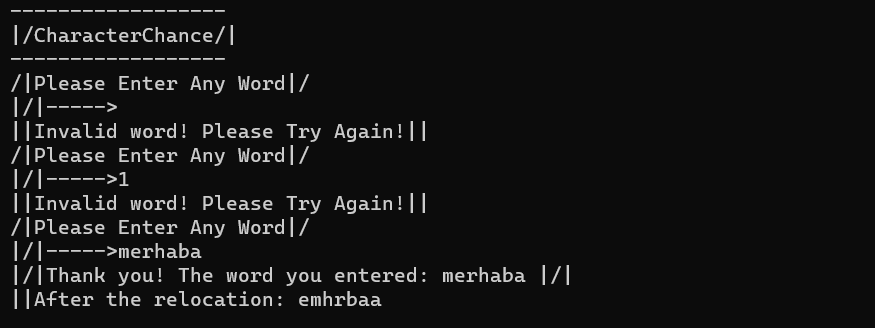

>>Verilen string ifade içerisindeki karakterleri bir önceki karakter ile yer değiştiren console uygulaması

>* Örnek: Input: Merhaba Hello Question

>* Output: erhabaM elloH uestionQ
---
>>Console application that replaces the characters in the given string expression with the previous character

>* Example: Input: Hello Hello Question

>* Output: helloM elloH uestionQ
---
