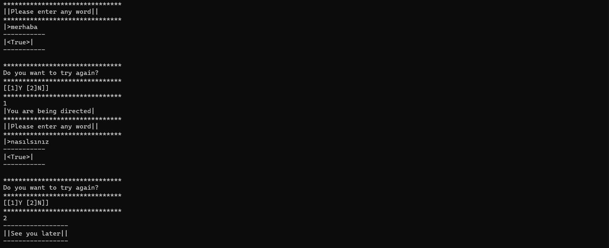

`-Sessiz Harf Kontrol Uygulaması-`
---
>* ||Kullanıcıdan alınan string ifade içerisinde yanyana 2 tane sessiz varsa ekrana true, yoksa false yazdıran console uygulaması||
>* `||Örnek: Input: Merhaba Umut Arya||`
>* `||Output: True False True||`
---
`-Silent Letter Control Application-`
---
>* ||A console application that prints true if there are 2 consonants next to each other in the string expression received from the user, otherwise false||
>* `|Example: Input: Hello Hope Arya||`
>* `||Output: True False True
***

***