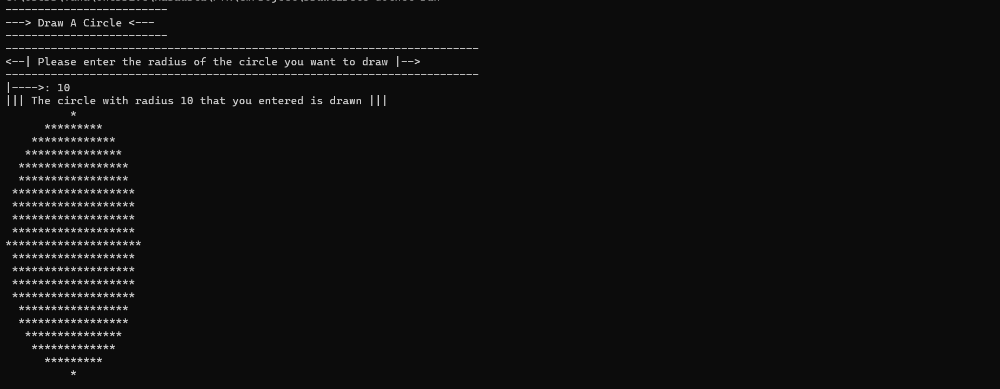

>  ***Daire Şekil Çizimi***
* Kullanıcıdan alınan yarıçapa göre console'a Daire çizen uygulamayı yazınız.
* Dikkat Edilmesi Gereken Noktalar :
* Kod tekrarından kaçınılmalı
* Single Responsibility kuralına uygun şekilde, uygulama sınıflara ve metotlara bölünmeli.
---
>***Flat Shape Drawing***
* Write the application that draws a circle to the console according to the radius received from the user.
* Points to be Considered :
* Code repetition should be avoided
* The application should be divided into classes and methods, following the Single Responsibility rule.
---

