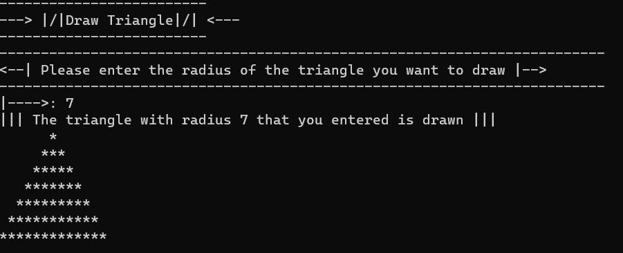

` _Kullanıcıdan alınan boyut bilgisine göre console'a Üçgen çizen uygulama_`

> * Dikkat Edilmesi Gereken Noktalar :
* Kod tekrarından kaçınılmalı
* Single Responsibility kuralına uygun şekilde, uygulama sınıflara ve metotlara bölünmeli.
---
` _Application that draws a triangle in the console according to the size information received from the user_`

* Points to Consider :
* Code repetition should be avoided
* The application should be divided into classes and methods, following the Single Responsibility rule.
***
