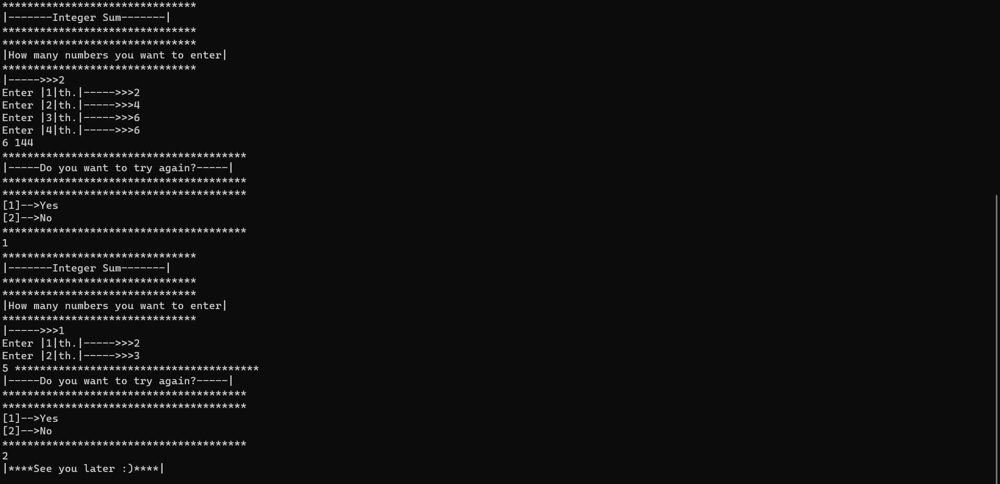
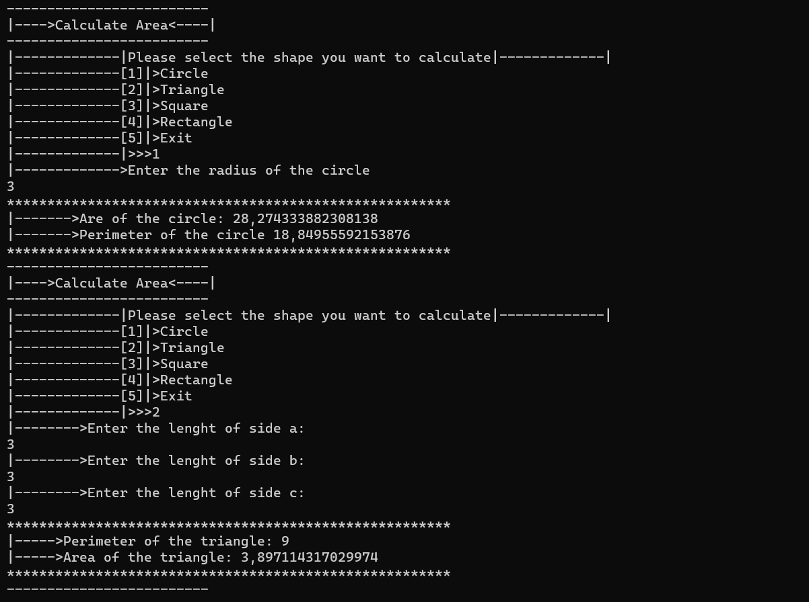

`C# Projeleri içinde kolay,orta ve zor  seviyeler olmak üzere birçok farklı console   program uygulaması bulunmaktadır.`
---
`Programlar`
>*  1.AbsoluteSquaring
>* 2.Algoritm
>* 3.AtmApp
>* 4.BarcodeGenerator
>* 5.CalculateArea
>* 6.CalculateAvarage
>* 7.CharacterChange
>* 8.ConsonantLetter
>* 9.DrawCircle
>* 10.DrawTriangle
>* 11.SumInteger
>* 12.VotingApp
>* 13.WritingReverse
***
`There are many different console program applications in C# Projects, including easy, intermediate and hard levels.`
---
`Programs`
>* 1.AbsoluteSquaring
>* 2nd Algorithm
>* 3.AtmApp
>* 4.BarcodeGenerator
>* 5.CalculateArea
>* 6.CalculateAvarage
>* 7.CharacterChange
>* 8.ConsonantLetter
>* 9.DrawCircle
>* 10.DrawTriangle
>* 11.SumInteger
>* 12.VotingApp
>* 13.WritingReverse
***
 

