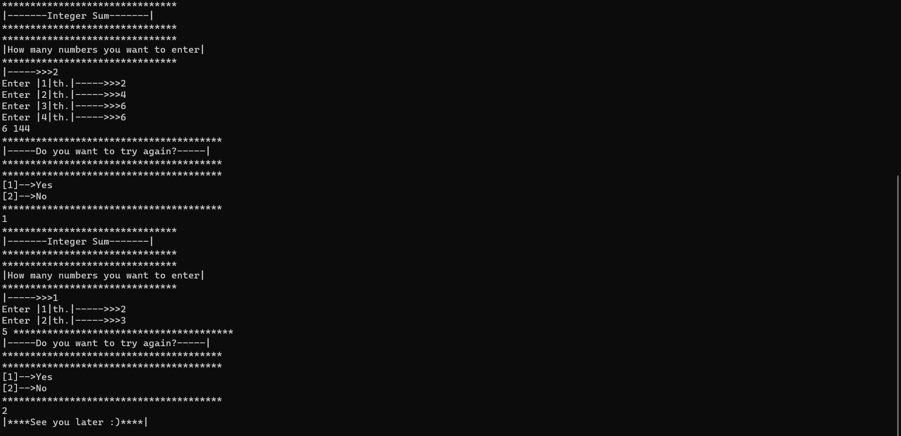

`-İkili sayı toplayan veya karesini alan program-`
--
***
` Console'dan girilen n tane integer ikililerin toplamını alan, eğer sayılar birbirinden farklıysa toplamlarını ekrana yazdıran, sayılar aynıysa toplamının karesini ekrana yazdıran console uygulamasını.`
***
```Örnek Input: 2 3 1 5 2 5 3 3```
```Output: 5 6 7 81```
***
`-Program that adds or squares binary numbers-`
--
***
`A console application that takes the sum of n integer binary numbers entered from the console, prints the sum if the numbers are different, and prints the square of the sum if the numbers are the same.`
***
`Example Input: 2 3 1 5 2 5 3 3 3`
`Output: 5 6 7 81`
***
