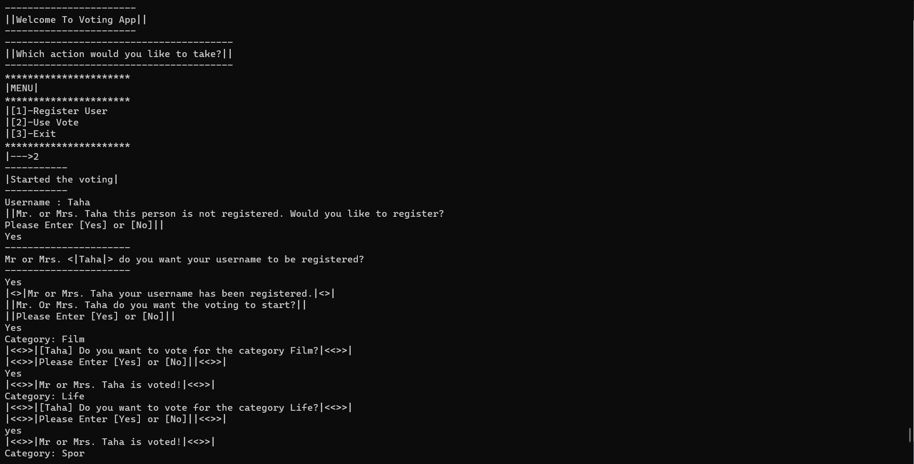
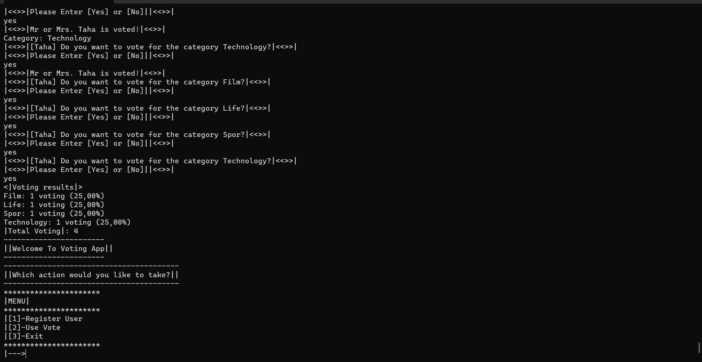

`Voting Uygulaması`
---
>* Uygulama çalıştığında pre-defined olarak belirlenen kategoriler oylamaya sunulmak üzere listelenmelidir. Yalnızca sisemde kayırlı olan kullanıcılar oy verebilir. Oylama sırasında öncelikle kullanıcının username'i istenmelidir. Eğer sistemde kayıtlı değilse kayıt olmasına imkan sağlanmalı ve kaldığı yerden oylamaya devam edebilmelidir. Kategoriler isteğe bağlı olarak belirlenebilir.
>* Bazı Örnek Kategoriler: Film Kategorileri Tech Stack Kategorileri Spor Kategorileri

>* Son olarak uygulama sonlandırılırken, Voting sonuçları hem rakamsal hem de yüzdesel olarak gösterilmelidir.
***
`Voting Application`
---
>* When the application runs, the pre-defined categories should be listed for voting. Only users registered in the system can vote. During voting, the username of the user should be requested first. If he/she is not registered in the system, he/she should be allowed to register and continue voting from where he/she left off. Categories can be determined optionally.
>* Some Example Categories: Movie Categories Tech Stack Categories Sports Categories

>* Finally, when finalizing the application, the Voting results should be shown both in numbers and percentages.
***
 

***
