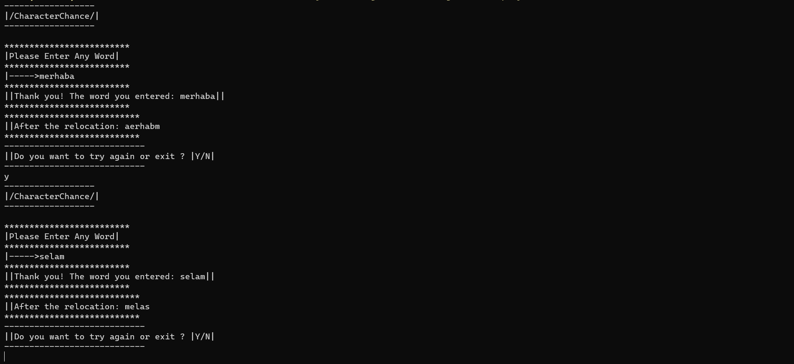

`|Kullanıcıdan alınan kelimenin ilk ve son harfini yer değiştiren "Console" uygulaması|`
---
>* |Verilen string ifade içerisindeki ilk ve son karakterin yerini değiştirip tekrar ekrana yazdıran console uygulaması|
>* |Örnek: Input: Merhaba Hello Algoritma x|
>* |Output: aerhabM oellH algoritmA x|
***
`"Console" application that replaces the first and last letter of the word received from the user`
---
>* |Console application that replaces the first and last character in a given string expression and prints it back to the screen|
>* Example: Input: Hello Hello Algorithm x|
>* |Output: aerhabM oellH algoritmA x|
***

***